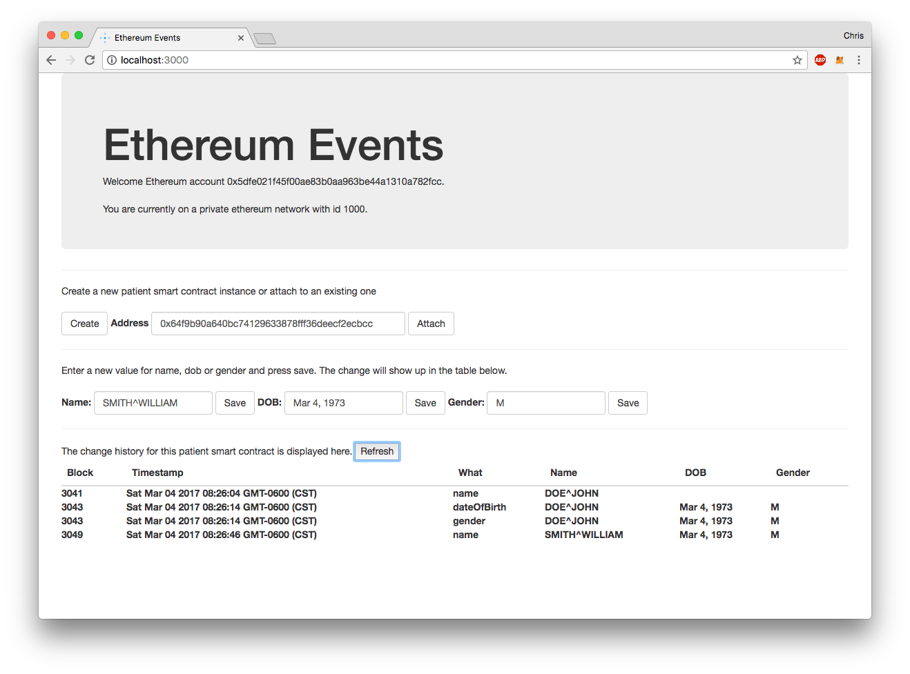

# ethereum-events
Supporting code for my applying blockchain to healthcare blog post on ethereum
for events and filters

Pre-requisites
--------------

1) Setup a private ethereum network from here: https://github.com/chafey/ethereum-private-network

2) [Metamask](https://metamask.io/) with supported browser (Chrome is what I use)

3) Meteor

How to run
----------

1) Make sure your ethereum private test network is running.  

2) Create an ethereum account in metamask using the coinbase private key (web3.eth.accounts[0]) in the private ethereum network:
0xf059416a2f6bb05d0770bbacb24a6430757aa7db5c15959838ed142b486df5b8

3) Make sure you are using the coinbase account in metamask and connected to the localhost 8545 network.  Metamask should show a large quantity of ether.

Start the meteor application:

> cd app

> meteor

Open your web browser to localhost:3000

.

Press "Create" to create a new patient smart contract instance.  After a few
seconds, geth will mine the transaction and the UI will update showing controls
to modify the patient smart contract and a history of changes.  Go ahead and
make some changes by entering values for name, dob and gender and pressing the
corresponding "save" buttons.  Pressing save will update that property in
the patient smart contract.  It may take several seconds for the updates to
apply (remember that ethereum has 15 second block times).  Press the "Update"
button to update the table of updates.  You will notice the block number is
displayed, the time stamp and the values of the properties at that point in
time.

You can also attach to an existing patient smart contract instance by entering
its address and pressing "Attach".  Once attached, the controls will be shown
with the current values and history for the attached instance.
